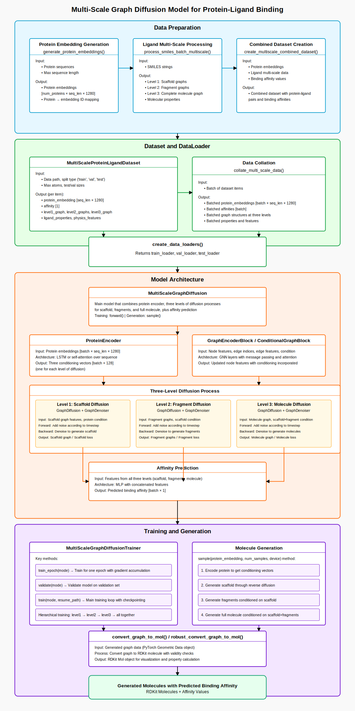

# Multi-Scale Graph Diffusion Model for Protein-Ligand Binding

This repository implements a novel multi-scale graph diffusion model for protein-ligand binding prediction and molecule generation. The model uses a hierarchical approach to generate molecules with desired binding properties against specific protein targets.



## Overview

This project introduces a hierarchical graph diffusion framework that models protein-ligand interactions at multiple structural levels:

1. **Level 1: Scaffold generation** - Creates the core structure of a molecule
2. **Level 2: Fragment attachment** - Adds functional groups to the scaffold
3. **Level 3: Full molecule refinement** - Optimizes the complete molecular structure

The model simultaneously learns to predict binding affinity while generating molecules, enabling targeted design of compounds with desired binding properties.

## Key Features

- **Multi-scale representation** of molecules with scaffolds, fragments, and complete structures
- **Protein sequence encoding** using state-of-the-art protein language models (ESM-2)
- **Graph neural networks** with message passing and attention mechanisms
- **Diffusion-based generative process** for controlled molecule generation
- **Affinity prediction** for evaluating protein-ligand binding
- **Physics-informed features** to enhance molecular validity

## Data Processing Pipeline

The data preparation workflow involves three main steps:

1. **Protein Embedding Generation**: 
   - Extracts full sequence embeddings from protein sequences using ESM-2
   - Handles long sequences with chunking and overlap

2. **Ligand Multi-Scale Processing**:
   - Generates scaffold hierarchies using Murcko scaffolds
   - Creates fragment representations using BRICS decomposition
   - Calculates molecular properties and physics-based features
   - Builds multi-level graph representations

3. **Combined Dataset Creation**:
   - Links protein embeddings with multi-scale ligand representations
   - Integrates binding affinity values for training

## Model Architecture

The model consists of several key components:

- **ProteinEncoder**: Processes protein embeddings to create conditioning vectors
- **GraphEncoderBlock/ConditionalGraphBlock**: Graph neural networks that incorporate conditioning
- **Three-Level Diffusion Process**: Separate diffusion models for scaffolds, fragments, and complete molecules
- **Affinity Prediction**: MLP-based module for binding affinity prediction

## Training and Generation

The model is trained using a hierarchical approach:

1. First train the scaffold generation (Level 1)
2. Then train the fragment attachment (Level 2)
3. Then train the full molecule refinement (Level 3)
4. Finally, train all levels together

For molecule generation, the model:
1. Encodes the target protein to get conditioning vectors
2. Generates scaffolds through reverse diffusion
3. Generates fragments conditioned on the scaffold
4. Combines scaffold and fragments to generate the full molecule
5. Predicts binding affinity between the protein and generated molecule


### Data Preparation

```python
# Process protein sequences to generate embeddings
process_in_chunks(parquet_file, chunk_size=5000, seq_chunk_overlap=128)

# Generate multi-scale ligand representations
generate_multiscale_ligand_representations(
    parquet_file=parquet_file,
    output_dir=output_dir,
    batch_size=5,
    n_jobs=10
)

# Create combined dataset
create_multiscale_combined_dataset(
    parquet_file=parquet_file,
    protein_embedding_file=protein_embedding_file,
    protein_map_file=protein_map_file,
    ligand_data_file=ligand_data_file,
    output_file=output_file,
    use_full_sequence=True,
    max_protein_length=1000
)
```

### Training

```python
# Create data loaders
train_loader, val_loader, test_loader = create_data_loaders(
    data_path, batch_size=batch_size, num_workers=2, max_atoms=max_atoms
)

# Create model
model = MultiScaleGraphDiffusion(
    node_dim=8,
    edge_dim=5,
    protein_dim=1280,
    hidden_dim=256,
    cond_dim=128,
    time_emb_dim=64,
    num_steps=1000,
    beta_schedule='cosine',
    num_layers=3,
    heads=4,
    dropout=0.1
).to(device)

# Create trainer
trainer = MultiScaleGraphDiffusionTrainer(
    model, train_loader, val_loader,
    lr=lr, weight_decay=weight_decay,
    max_epochs=max_epochs,
    device=device,
    save_dir=save_dir,
    accumulation_steps=4,
    use_mixed_precision=True,
    checkpoint_frequency=5
)

# Train model
trainer.train(mode='hierarchical')
```

### Molecule Generation

```python
# Load a protein embedding
protein_emb = sample_data['protein_embedding'][0:1]

# Generate molecules
generated = model.sample(protein_emb, num_samples=1, device=device)

# Display predicted affinity
predicted_affinity = generated['predicted_affinity']
print(f"Predicted binding affinity: {predicted_affinity.item():.4f}")

# Convert to RDKit molecule for visualization
mol = robust_convert_graph_to_mol(generated['molecules'], batch_idx=0)
```

